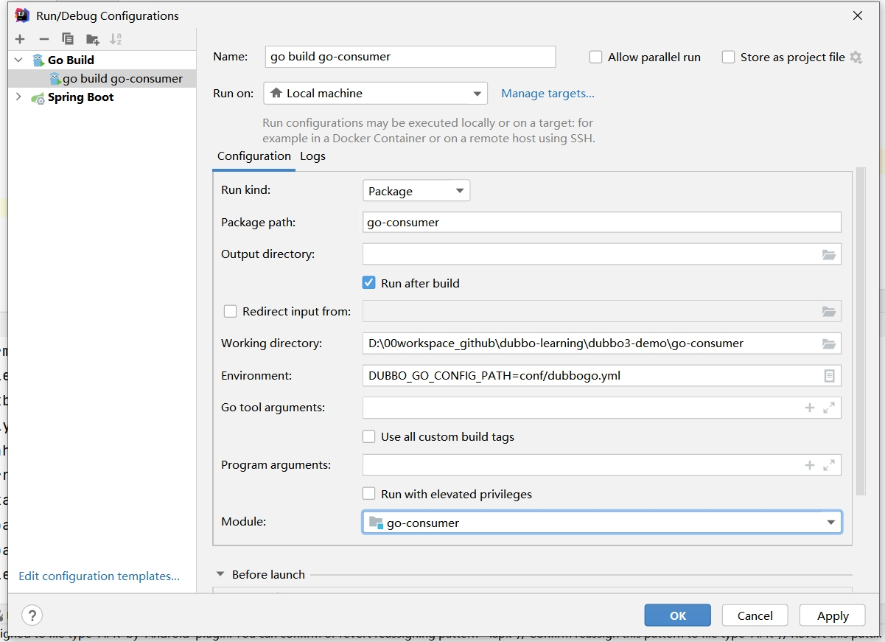

# dubbo-demo 简单的dubbo程序

- dubbo3.x 之前，认为1个 service 接口就是1个服务
- 启动 zk，作为 dubbo 的注册中心

## zk注册信息
`接口名:List<实例IP+port>`
```shell
./bin/zkCli.sh -server [ZooKeeper地址]:[端口]
./bin/zkCli.sh -server 127.0.0.1:2181

ls /dubbo
ls /dubbo/[接口名]/providers   # 查看服务提供者  
ls /dubbo/[接口名]/consumers   # 查看服务消费者
ls /dubbo/com.xcrj.api.ProviderServiceInterface/providers #查看接口的提供者
ls /dubbo/com.xcrj.api.ProviderServiceInterface/consumers #查看接口的消费者
```

# dubbo-simulate 手写dubbo

- tomcat 是 servlet 容器
- 先编写Provider，再编写Consumer

## Dubbo的服务调用基本原理

- Provider: 本地注册，启动Tomcat
- HttpServer: 创建Tomcat，加入DispatcherServlet
- HttpServerHandler: 解析http请求获得Invocation，调用本地方法
- LocalRegister: 本地注册interface的实现类
- Invocation: 封装远程调用方法信息
- Consumer: 创建interface Proxy类，调用方法
- ProxyFactory: 发送http请求

## Dubbo的服务调用流程

1. 启动Provider，创建Tomcat，加入DispatcherServlet，接收http req，解析http req，获得Invocation，反射调用方法
2. 运行Consumer，动态代理interface，调用方法，创建invocation，发送http请求，获取结果

## Dubbo的服务注册基本原理

需要

- 注册信息: {服务名:List<URL>}, RemoteMapRegister
- 服务发现: 本地缓存
- 远程本地同步: zk的wtach机制，redis的pub/sub机制
- 心跳机制: 服务地址变动主动通知服务消费者, 心跳机制（zkCli和zkServer维持心跳）
- Map不能跨JVM进程，利用文件跨进程

过程

1. Provider: 远程注册
2. Consumer: 服务发现
3. 注册中心: 文件

## protocol

- HTTP: Tomcat
- TCP: Netty
- 避免修改代码切换Protocol，再抽象Protocal接口，DubboProtocol，HttpProtocol，工厂模式

## 服务容错
- 调用服务出现异常，返回更加友好的信息，try{ProxyFactory中send}catch(){}
- 重试，第一次调用失败：while(){try{ProxyFactory中send}catch(){}}
- 调用失败，记录，定时再调1次

## 路由
- 广播：ProxyFactory中invoke，获取远程注册的所有地址，广播

## mock
- mock未实现好的服务: ProxyFactory中invoke

# dubbo3-demo
1. 依赖：dubbo、注册中心、协议
2. 配置：dubbo、注册中心、协议
3. 代码：@EnableDubbo, @DubboReference, @DubboService

## 注册模型的改变
spring cloud：服务名: List<实例IP+port>

dubbo2.x：接口名:List<实例IP+port>
- 优点：consumer找起来方便。一般，应用名》实例》接口》实现
- 缺点：应用提供接口很多，向注册中心 注册的内容增多，网络IO增大

dubbo3.x：服务名:List<实例IP+port>
- 为了兼容旧版本，默认同时进行接口级别 和 应用级的注册 
- dubbo.application.register-mode=instance/interface/all(默认)
- 原理：通过应用名找到接口，接口:应用名存储到zk的mapping中

配置
- `dubbo.application.register-mode=all` 默认
- `dubbo.application.register-mode=instance`
### zk注册信息
`接口名:List<实例IP+port>` 变为 `服务名:List<实例IP+port>`
```shell
#接口名:List<实例IP+port>
ls /dubbo/com.xcrj.UserService/providers

#服务名:List<实例IP+port>`
ls /services/producer-app
```

## 新一代RPC协议 Triple
dubbo3 triple协议优点，基于HTTP/2，兼容gRPC
-  可调用HTTP/1的服务（HTTP/2兼容HTTP/1）
-  可调用gRPC的服务

dubbo2 dubbo协议缺点，基于netty，不兼容HTTP1.x
-  HTTP》网关》dubbo，网关需要进行协议转换，降低性能

使用Triple协议，用户将获得以下能力
- 更容易适配网关、Mesh架构，Triple协议让Dubbo更方便的与各种网关、Sidecar组件配合工作。
- 多语言友好，推荐配合Protobuf使用Triple协议，使用IDL定义服务，使用Protobuf编码业务数据。
- 流式通信支持。Triple协议支持Request Stream、Response Stream、Bi-direction Stream

## Triple 简单使用
- producer 添加 pom 依赖， dubbo-rpc-triple
- consumer 添加 pom 依赖， dubbo-rpc-triple
- producer 修改 yml 配置， dubbo.protocol.name=tri
- consumer 不用修改 yml 配置， 根据注册信息自动选用 triple 协议 

## Triple 流式通信
- UNARY: 客户端发送1次，服务端发送1次
- SERVER_STREAM: 服务端可以发送多次
- BI_STREAM/CLIENT_STREAM: 客户端既可以发送多次，服务端也可以发送多次

SERVER_STREAM: 
- 客户端 new StreamObserver 观察服务端的响应

BI_STREAM/CLIENT_STREAM: 
- 客户端 new StreamObserver 观察服务端的响应
- 服务端 new StreamObserver 观察客户端的响应

## 多语言
协议多语言，接口代码多语言

协议多语言：Triple协议

接口代码多语言：
- protobuf编码，支持接口代码多语言
- 编写*.proto文件`producer/src/main/proto/userservice.proto`，各个语言都可用
- 使用protobuf各个语言的编译器编译*.proto文件
  mvn插件生成java接口代码（mavem/producer/compile）；生成go接口代码（protoc-3.20.1-win64程序）
- 不需要common模块了，去掉producer/pom.xml中的common模块依赖
  
协议多语言：
- go-consumer模块，使用tri协议
- dubbo3-demo-producer模块，协议由dubbo改为tri

mvn插件生成java接口代码：
1. 在producer/pom.xml中配置插件protobuf-maven-plugin
2. 执行mavem/producer/compile

生成go接口代码（protoc-3.20.1-win64程序）：
1. 下载地址`https://github.com/protocolbuffers/protobuf/releases/download/v3.20.1/protoc-3.20.1-win64.zip`
2. 解压，将`protoc-3.20.1-win64\bin`添加到path环境变量
3. cmd中执行`protoc --version`查看到结果代表成功
4. cmd进入`go-consumer/proto`下，执行
```shell
go env -w GO111MODULE=on
go env -w GOPROXY=https://goproxy.cn,direct

go mod tidy
go get google.golang.org/protobuf/cmd/protoc-gen-go
go get -u github.com/dubbogo/tools/cmd/protoc-gen-go-triple
go install google.golang.org/protobuf/cmd/protoc-gen-go
go install github.com/dubbogo/tools/cmd/protoc-gen-go-triple
protoc -I. userservice.proto --go_out=../api --go-triple_out=../api
#下载生成代码所需依赖
go mod tidy
```

### golang安装
安装golang:
1.下载地址：https://studygolang.com/dl/golang/go1.22.0.windows-amd64.msi
2.然后直接下一步安装
3.新开一个cmd窗口执行`go version`，看到版本号表示安装成功

### idea go插件安装
1. setting/pugins中market搜索 go
2. languages & Frameworks/go配置goroot和gopath

gopath
- global gopath: 
- project gopath:

### 运行go-consumer


## dubbo 与 spring cloud HTTP服务互相调用

## dubbo 与 gRPC 服务互相调用